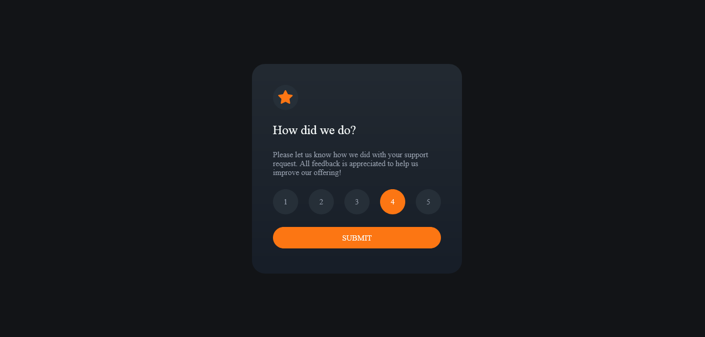

# Frontend Mentor - Interactive rating component solution

This is a solution to the [Interactive rating component challenge on Frontend Mentor](https://www.frontendmentor.io/challenges/interactive-rating-component-koxpeBUmI). Frontend Mentor challenges help you improve your coding skills by building realistic projects. 

## Table of contents

- [Overview](#overview)
  - [The challenge](#the-challenge)
  - [Screenshot](#screenshot)
  - [Links](#links)
- [My process](#my-process)
  - [Built with](#built-with)
  - [What I learned](#what-i-learned)
  - [Continued development](#continued-development)
  - [Useful resources](#useful-resources)
- [Author](#author)
- [Acknowledgments](#acknowledgments)

**Note: Delete this note and update the table of contents based on what sections you keep.**

## Overview

### The challenge

Users should be able to:

- View the optimal layout for the app depending on their device's screen size
- See hover states for all interactive elements on the page
- Select and submit a number rating
- See the "Thank you" card state after submitting a rating

### Screenshot

### Links

- Solution URL: [Add solution URL here](https://your-solution-url.com)
- Live Site URL: [Add live site URL here](https://your-live-site-url.com)

## My process
my work process was to design the layout using html and style with css. Afterwards, I used javascript for adding the hover, clicked states.

### Built with
-html
-css
-javascript

### What I learned
- I learnt about how to center an element 
- javascript foreach loop and methods for accessing the various child nodes.
- adding hover and active states to an element

### Useful resources

- looked stack overflow for getting the functionality done

## Author

- Website - [jasbinder singh](https://www.your-site.com)
- Frontend Mentor - [@jasbinder-singh](https://www.frontendmentor.io/profile/jasbinder-singh)
